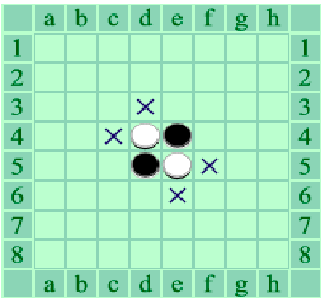
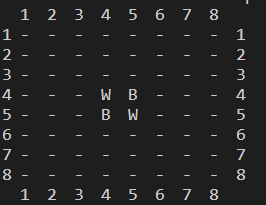
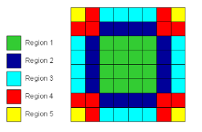
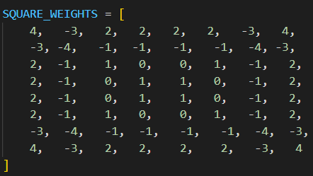
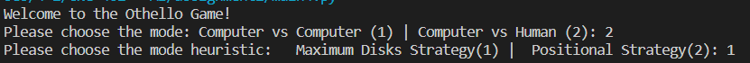
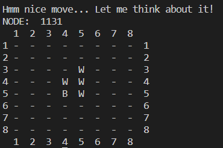
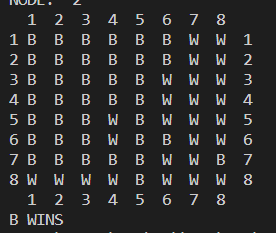

# OthelloGame

## Othello

Othello Game implemented with Minimax algorithm with Alph-Beta Pruning

Othello is a board game. It is played onto 8x8 sqaure grid. Each player has pieces whether black or white. The initial state of the othello is in the following figure.

    

The aim of the game is having more pieces than the opponent at the end of the game. If there are proper conditions which are explained in the assignment paper, the capturing occurs. The game ends when there is no valid move, means the board is full.

## Implementation

For implementing the Othello game, I have decided to go with a basic interface. The initial state of the board in our implementation can be found in the following figure. 

    

The “W” symbol represents the “white” pieces and the “B” represents the “black” pieces. “-“ represents that, this cell is empty, no piece on it. 

## Heuristic

We have used 2 different heuristic function for the Othello. One of the heuristic is the difference of number of the white pieces and black pieces. By taking the difference , we aimed that in each turn, the algorithm tends to take more piece as possible. The algorithm counts the number of pieces in each turn, and take the difference. This is similar to the Maximum Disks Strategy. 
Addition to this heuristic, we have implemented another heuristic also. In Othello, corners of the grid is so important because they are well protected, and they might have the maximum capture. The following figure shows the important spots for the game. 

    

For every region we have determined a value based on their signifance level. In each turn, algorithm checks that heuristic to make a decision. The values of the determined areas can be found in the following figure;

    

## HOW TO PLAY

When the main.py is running, there will be a menu asking for choosing the mode. There are 2 modes in the game, computer vs computer and computer vs human. You can choose one of the mode above. Additionally, the menu will ask you to choose the heuristic. Since there are a lot of strategies in the game, you need the choose one of them. The heuristics are explained in the section above. You can see the menu example in the following figure.

    

After entering the inputs, the computer will start first. In each play, the board will be shown on the screen. You can see the example in the following figure. 

    

Also you can see the number of node that is visited by the computer to choose the proper position. After computer plays, the program will ask you to enter the position that you want to play. You need to enter the row and column.

The game is played untill it is done. When you select the computer vs computer, it will run untill the game is done again , and every move it will display the board. At the end of the game, the game will determine the winner. 

    

